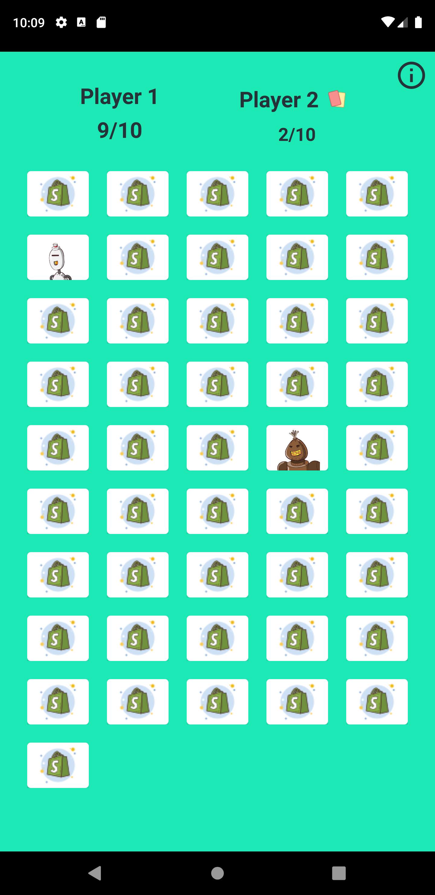
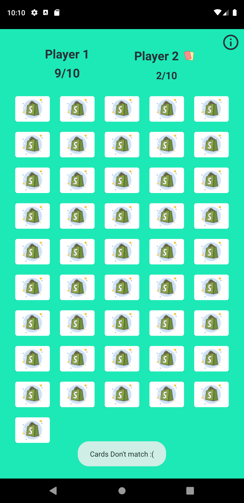
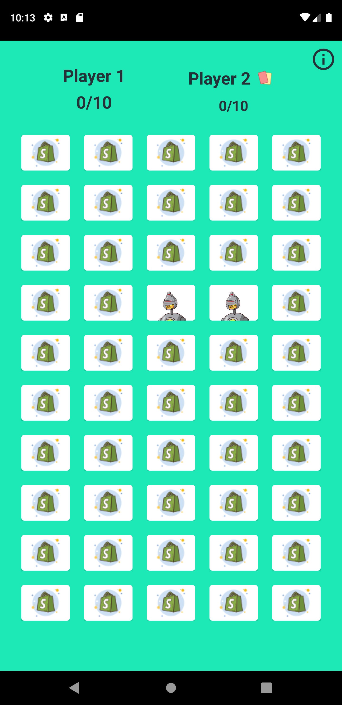
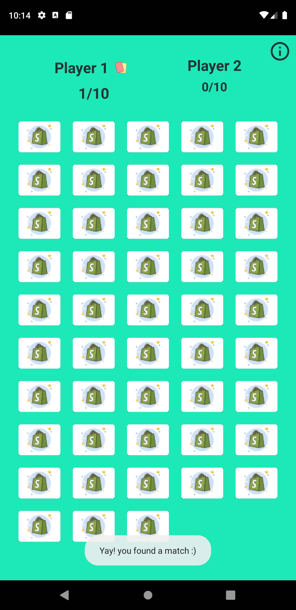

# Match-the-Cards

This is a card matching game, where the player has to remember the card position in a matrix and match sets of 2,3 or 4 cards to get one point. The player who reaches 10 points wins the game. This game allows the user to set the difficulty of the game (Amateur = 2 matches for 1 point, Pro = 3 matches and Legend = 4 matches). This app also allows the user to set the matrix size by defining the number of columns of the matrix. Finally the game allows the user to shuffle the cards by shaking their device. 

## Screenshots

#### When One card is opened 

#### When Two different cards are opened
 

#### When the cards are same
 

#### When a player wins the game

## Insights
This game has been built using Kotlin whilst following the [MVVM architecture](https://developer.android.com/jetpack/docs/guide). This architecture allows me to separate the UI code from the computational code. This architecture is promoted by google. This app uses various components of the Jetpack library like:
1. Data Binding.
2. Live Data.
3. Navigation Component.

## Tasks Completed.
- [x] Make the game configurable to match 3 or 4 of the same products instead of 2.
- [x] Make the grid size configurable.
- [x] Build a slick screen that keeps track of the user’s score.
- [x] Make a button that shuffles the game. (Instead of a button, I decided to implement a shake listener to shuffle the cards)
- [x] Feel free to make the app beautiful and add anything else you think would be cool!

## Sources and Library refrences
- [Lottie] (https://airbnb.io/lottie/#/) animation library by Airbnb.
- All the icons have been taken from [icons8] (https://icons8.com/icons) 

## Future Changes 
- In future I would like to write my own animations to enhance the UI and I would like to link the app to google Play games to maintain a leaderboard. 

## Notes
- I have added an apk just so its easier for you to run the application (looking forward to hear some valuable feedback).
- I hope you enjoy using it, as much as I have enjoyed building it :).
